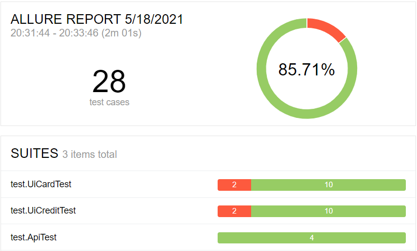

# Отчет по итогам тестирования
В соответствии с Планом тестирования, Приложение было протестировано по всем запланированным позитивным и негативным сценариям.

Было проведено **28 тест - кейсов**: из них 24 прошли успешно (85.71% успешных тест-кейсов)  и 4 неуспешно (14,21% тест-кейсов).

Графическое представление результатов тестирования, выполненное с использованием AllureReport, приведено ниже:

По итогам тестирования обнаружено 6 багов. По всем багам заведены [Issues](https://github.com/Irina04041987/Diploma/issues).
1. В поле "Владелец" возможно ввести цифры или цифры и буквы, такая операция проходит со статусом "Одобрено" и информация фиксируется в БД.
2. При вводе невалидного номера карты в обоих случаях оплаты (дебетовая карта и кредит) в приложении операция проходит со статусом "успешно", но в БД фиксируется, что операция отклонена банком.
3. После очистки неверно заполненного поля, по которому вышло системное сообщение "Неверный формат",подсказка о неверном формате заполнения данных не пропадает
при введении данных правильного формата.
4. Орфографическая ошибка в заголовке предложения тура.
5. Кнопка "Купить в кредит" по умолчаниюи выделена красным, при нажатии на Кнопку "Купить"
   подсветка кнопки "Купить в кредит" должна переходить на кнопку "Купить".
6. В общей таблице order_entity заказы в кредит отражаются в поле для заказов, оплаченных по карте.
   
Баги 2 и 6 являются критичными для работы и ведут к потере данных или неправильной их интерпретации. Требуют незамедлительного устранения.
Остальные бага должны быть устранены в плановом порядке. 

